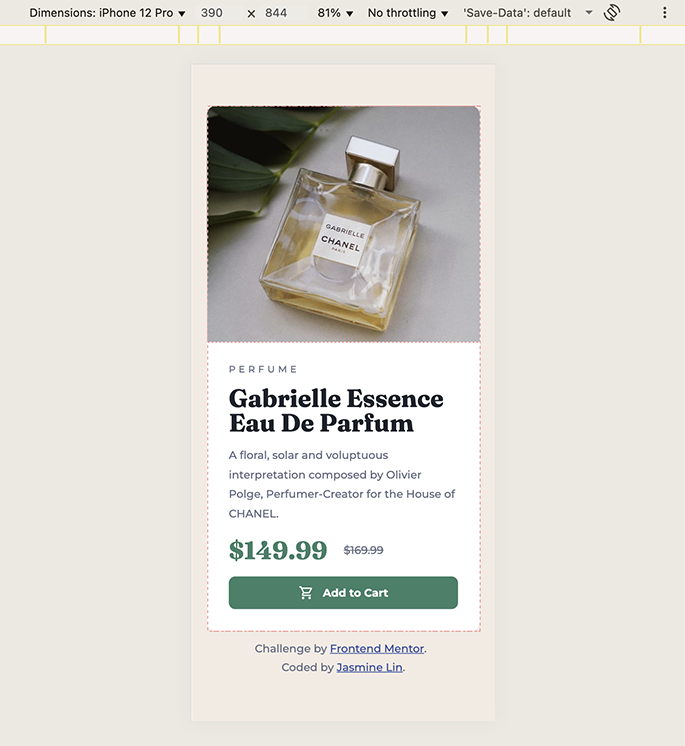

# Frontend Mentor - Product preview card component solution

### The challenge

Users should be able to:

- View the optimal layout depending on their device's screen size
- See hover and focus states for interactive elements

### Screenshot

### Links

- Solution URL: [Github repo](https://github.com/jasminelin921/frontend-mentor-solutions/tree/main/02_product-preview-card-component)
- Live Site URL: [Product preview](https://jasminelin921.github.io/frontend-mentor-solutions/02_product-preview-card-component/)

## My process

### Built with

- Semantic HTML5 markup
- CSS Flex

## Author

- Website - [My Github homepage](https://github.com/jasminelin921)
- Frontend Mentor - [@jasminelin921](https://www.frontendmentor.io/profile/jasminelin921)

## Acknowledgments

Thank you to Frontend Mentor for providing this challenge!
